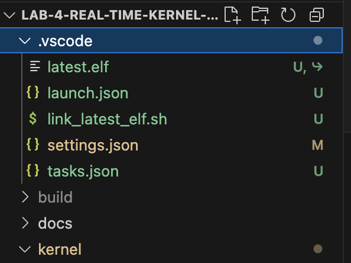
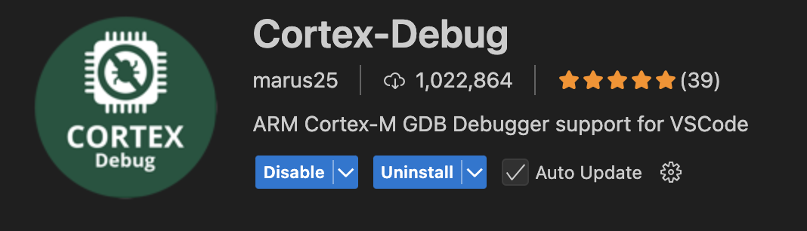

# STM32 GDB (GUI) VS Code Configuration

## Why?
If you're reading this, then you're probably an 18-349 student in the midst of debugging your real time kernel. If that's the case, then you're one of these 3 people:

1) You're a cracked genius and you're already done. In that case, you probably don't even need to follow the guide because you're quite literally a human debugger with wireless `JTAG` built into your brain, interfacing with your `STM32` Nucleo board.
2) This lab is giving you a hard time. We know, we're sorry kernel lab is back. It only gets worse from here (or better, you get to build a car!! woah!!).
3) You want to use your `gdb` debugger, but you're tired of keeping track of your breakpoints, and having to reinsert them after building your project again. You're also tired of doing `i r` to examine your register contents or some weird stuff like `x/3uh 0x54320`.

If you're **2 and/or 3** (or 1 🤔), keep reading! This is a guide about how to set up a graphical version of your `gdb` debugger using VS Code and how to make your debugging journey a little bit less chaotic.

**Note: If you're using `vim` or `emacs` (oh god, emacs in 2025 😭) or some cool JetBrains IDE (ur a chill guy if this u tho 😪), then I'm sorry, I've got nothing for you.**

## Okay cool. What do I need?
1) Open **VS Code** and open just the directory containing your lab files/folders. You probably already have this `.vscode` directory as shown below in there. If not, then create it. Inside it, create 3 files:
* `launch.json`: Configuration file that defines how the debugger should behave when running and debugging your code.
* `tasks.json`: Allows you to define custom tasks and configure how they should be executed.
* `settings.json`: This contains your editor's configuration and preferences. I provided a sample file, but you can include whatever you want in here.

2) Copy the `launch.json` and `tasks.json` file contents from the repository onto your own (optional: add any other configurations you'd deem necessary).
3) Download the shell (`.sh`) script and add it to the `.vscode` directory as shown above. Don't worry about copying the `latest.elf` file, that's a binary generated by the build when you run `make flash`. The `link_latest_elf.sh` script will look for the `ELF` file based on the test you want to build (e.g. `test_0_0` or `test_8_1`).
4) Finally, insert this snippet of code into your `MakeFile` right underneath the block of code for the `flash: build` command. This prevents `gdb` from being launched from the command line when we're trying to launch it from **VS Code**. I uploaded my Makefile under the `build-update` directory of the repository for your reference.
```
flash-nogdb: build
	cp util/init_template.nc /tmp/init.nc
	sed -i -e 's|<template>|$(BINARY)|g' /tmp/init.nc
	cp util/init_template.gdb /tmp/init.gdb
	sed -i -e 's|<template>|$(BINARY)|g' /tmp/init.gdb
	@printf "\n"
	@printf "$y***************************************************************\n$n"
	@printf "$yFlashing $(BINARY) to board...\n$n"
	@printf "$y***************************************************************\n$n"
	cat /tmp/init.nc | nc localhost 4444 $(NC_FLAGS)
	@echo "Flashing complete (without launching GDB)."
```
5) Install the **ARM Cortex-Debug extension** from **VS Code** shown below.


## Almost done. Now how do I run this thing?
You can watch a video of me going over the basics of the debugger located in [this Google Drive link](https://drive.google.com/drive/u/0/folders/1l2Wg7Z3TQQ5xcD8W3VgBLKguNfWpzEvx). If that wasn't too helpful, I'm sorry lol. Please reach out on Piazza though if you have any questions or issues. There's also a couple of good videos on YouTube going over clever debugging tips with GDB, so those might be worth going over. Good luck!
